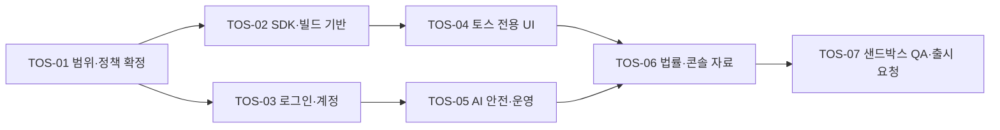

# ALIVE 앱인토스 출시 선행작업 백로그

## 목적

토스 콘솔에서 앱 등록·사업자 승인이 끝난 뒤, `앱 출시` 메뉴에서 출시 검수를 요청할 수 있는 상태까지 ALIVE를 준비한다. 이 문서는 독립 iOS·Android 앱을 바꾸지 않고 앱인토스 전용 빌드를 추가하는 작업 계획이다.

## 전제와 성공 기준

- 토스용 초기 MVP는 토스 로그인, 캐릭터 생성·수정, AI 피드, 사용자와 AI 캐릭터의 대화, 신고·차단·계정 삭제만 제공한다.
- 공개 탐색·팔로우·공유, 실제 이용자 간 대화, 결제·광고·프로모션, 기존 독립 앱 계정의 자동 병합은 첫 출시에서 비노출한다.
- 토스 로그인 사용을 전제로 한다. 사업자 승인이 완료됐으므로 mTLS 인증서 발급과 로그인 API 연동을 진행할 수 있다고 가정한다.
- 채널톡 사전 문의는 일반 출시의 필수 절차로 보지 않는다. 단, 첫 출시 범위에 공개 사용자 간 소통, 결제, 또는 정책 해석이 모호한 기능을 넣을 때만 선택적으로 문의한다.
- 성공은 토스 샌드박스에서 핵심 흐름과 오류·안전 흐름을 통과하고, 출시 정보·법률 문서·`.ait` 번들이 준비되어 출시 검수를 요청하는 것이다. 콘솔의 앱 승인만으로 사용자 공개 출시가 완료된 것은 아니다.

## 순서와 의존 관계

## 출시 백로그

| ID | 우선순위 | 태스크 | 완료 기준 | 선행 조건 | 예상 |
| --- | --- | --- | --- | --- | --- |
| TOS-01 | P0 | 출시 범위 확정 | MVP 포함·제외 기능과 외부 법률 링크 처리 방식을 1페이지로 확정한다. 공개 사용자 간 소통·결제·정책 해석이 모호한 기능을 포함할 때만 채널톡 문의를 추가한다. | 없음 | 0.5일 |
| TOS-02 | P0 | 앱인토스 SDK 2.x·전용 빌드 추가 | `@apps-in-toss/web-framework` 2.x, `granite.config.ts`, `ait build` 명령, 콘솔과 일치하는 appName·브랜드 설정을 추가하고 `.ait` 빌드를 만든다. | TOS-01 | 1~2일 |
| TOS-03 | P0 | 런타임 분리와 정책상 비노출 | 앱인토스·웹·Capacitor 런타임을 명시적으로 구분한다. 토스 빌드에서 Google/Apple OAuth, 스토어·자사 웹 유도, 외부 결제, 보류 기능이 노출·호출되지 않음을 테스트한다. | TOS-02 | 2~3일 |
| TOS-04 | P0 | 토스 로그인 서버 기반 마련 | 콘솔 mTLS 인증서·키·복호화 키를 배포 비밀 저장소에 등록하고, 만료일·교체 담당자를 기록한다. 서버에서 토스 API에 mTLS 연결이 되는지 확인한다. | TOS-01 | 1~2일 |
| TOS-05 | P0 | 토스 로그인과 계정 수명주기 구현 | `toss` 사용자 공급자 DB 마이그레이션, 토스 로그인 토큰 검증, 사용자 생성/조회, 세션 발급, 연결 해제·탈퇴 콜백 처리를 구현한다. 기존 계정 자동 병합은 하지 않는다. | TOS-04 | 3~5일 |
| TOS-06 | P0 | 로그인 회귀·웹뷰 세션 검증 | 토스 로그인 성공·취소·재진입·연결 해제와 WebView의 쿠키/CORS/API URL을 샌드박스에서 검증한다. Google·Apple 독립 앱 로그인 회귀 테스트도 통과한다. | TOS-03, TOS-05 | 1~2일 |
| TOS-07 | P0 | 토스 전용 라이트 디자인 확정 | 인증, 캐릭터 설정, 홈, 피드, DM의 다섯 화면을 TDS·라이트 모드 기준으로 설계한다. 앱 이름·로고·브랜드 색상을 명확히 유지하고 문구를 해요체로 정리한다. | TOS-01 | 2~4일 |
| TOS-08 | P0 | 토스 전용 UI 구현 | 전용 테마를 적용하고 토스 기본 내비게이션과 중복되는 상단/하단 UI를 제거한다. 작은 화면, 글자 확대, 대비, 뒤로 가기 동작을 검증한다. | TOS-03, TOS-07 | 3~5일 |
| TOS-09 | P0 | AI 고지와 생성물 표시 | 최초 AI 사용 고지의 동의 상태를 저장하고, AI 피드·댓글·DM·이미지에 일관된 `AI 생성` 표시를 추가한다. 사용자가 수정한 결과물의 표시 기준도 문서화한다. | TOS-03 | 1~2일 |
| TOS-10 | P0 | AI 안전 제어 강화 | AI 입력과 출력에 선정성·폭력·자해·혐오·불법·개인정보 위험 검사를 적용한다. 자해·자살 감지 시 생성 중단과 안전 안내, 우회 요청을 포함한 거절 응답을 구현하고 자동 테스트한다. | TOS-09 | 3~5일 |
| TOS-11 | P0 | 신고·차단·운영 대응 검증 | 피드·댓글·DM의 신고와 차단이 실제 노출에 반영되는지 확인한다. 신고 분류, 우선순위, 조치, 이의제기, 긴급 차단 책임자와 SLA를 운영 문서로 확정한다. | TOS-10 | 1~2일 |
| TOS-12 | P0 | 법률·고객지원 정보 갱신 | 개인정보처리방침에 토스 로그인·AI 데이터 흐름을, 약관에 AI 표시·금지 콘텐츠·제재 기준을, 계정 삭제 안내에 토스 연결 해제를 반영한다. 실제 모니터링되는 고객 문의 채널과 책임자를 등록한다. | TOS-05, TOS-11 | 1~2일 |
| TOS-13 | P1 | 출시 콘솔 자료 제작 | 실제 MVP와 일치하는 서비스 설명·카테고리·고객지원 정보, 콘솔 규격의 로고와 스크린샷을 준비한다. 기능을 과장하거나 독립 앱 설치를 유도하는 소재는 넣지 않는다. | TOS-07 | 1~2일 |
| TOS-14 | P0 | 자동·수동 출시 QA | 타입 검사·도메인/백엔드 테스트·프로덕션 빌드를 통과한다. 샌드박스에서 로그인, 캐릭터 생성, AI 생성, DM, 신고/차단, 계정 삭제, 네트워크 오류, 재진입, 금지 요청을 QA 시트와 증빙으로 완료한다. | TOS-06, TOS-08, TOS-10, TOS-12 | 2~3일 |
| TOS-15 | P0 | 번들 업로드와 출시 검수 요청 | 압축 해제 기준 100MB 이하 `.ait` 번들을 올리고, 콘솔 앱 정보·정책 URL·테스트 계정·QA 증빙을 대조한 뒤 출시 검수를 요청한다. | TOS-13, TOS-14 | 0.5일 |

## 단계별 산출물

| 단계 | 산출물 | 출시 게이트 |
| --- | --- | --- |
| 1. 정책·범위 | MVP 범위표, 필요 시 채널톡 질의·답변 기록 | 첫 출시에서 제공할 기능과 비노출 기능이 명확하다. |
| 2. 플랫폼·인증 | SDK 2.x 빌드, 런타임 분기, mTLS 비밀 설정, 토스 로그인 | 토스 빌드에 외부 로그인·외부 유도 경로가 없다. |
| 3. UI·AI 안전 | 라이트 TDS 핵심 화면, AI 고지·라벨, 안전 응답·신고 운영 | AI 생성 사실과 위험 대응을 사용자가 확인할 수 있다. |
| 4. 법률·운영 | 갱신된 약관/개인정보/삭제 안내, 문의·인시던트 운영 문서 | 실제 동작과 정책 문서가 일치한다. |
| 5. QA·출시 | 샌드박스 QA 결과, 출시 자산, `.ait` 번들 | 검수자가 재현 가능한 테스트 경로와 증빙이 있다. |

## 반드시 막아야 할 출시 차단 조건

- 토스 빌드에서 Google·Apple 로그인, 외부 가입·결제·앱 설치 유도 링크가 보이거나 실행된다.
- AI 최초 고지 또는 AI 생성 결과 표시가 빠져 있다.
- 자해·성적·폭력·불법 요청에 대한 생성 제한과 운영자 대응 절차가 없다.
- 라이트 모드와 토스 내비게이션 대응 없이 독립 앱 화면을 그대로 사용한다.
- 토스 로그인 mTLS 비밀 관리, 연결 해제, CORS/WebView 세션 검증이 완료되지 않았다.
- 토스 샌드박스에서 검증하지 않았거나, 출시 범위에 포함한 공개/공유/DM 기능의 정책 분류가 미해결이다.

## 권장 일정

한 명의 개발자 기준으로는 3~6주를 잡는다. 첫 주에는 TOS-01~04와 디자인 확정, 2~3주차에는 인증·런타임·전용 UI, 4주차에는 AI 안전·법률·운영, 마지막 1~2주에는 샌드박스 QA와 검수 보완에 쓴다. 공개 소셜 기능이나 결제를 최초 범위에 넣으면 별도 정책 검토와 구현이 필요해 이 일정에서 제외한다.

## 바로 시작할 일

1. TOS-01에서 MVP 범위를 확정한다: **공개 탐색·공유·결제는 첫 출시에서 제외**한다. 이 범위라면 채널톡 사전 문의는 생략한다.
2. 콘솔에서 토스 로그인용 mTLS 인증서 발급 경로와 비밀 저장소 등록 방법을 확인한다.
3. `앱 출시` 메뉴의 앱 정보 필수 항목과 스크린샷 규격을 캡처해 TOS-13의 입력값으로 고정한다.
4. TOS-02의 SDK 2.x 연동 스파이크를 구현해 샌드박스에서 빈 화면이 아닌 현재 앱 진입을 먼저 확인한다.

## 참고

- [기존 웹 프로젝트 SDK 연동](https://developers-apps-in-toss.toss.im/tutorials/webview.html)
- [SDK 2.x 마이그레이션](https://developers-apps-in-toss.toss.im/bedrock/reference/framework/%EC%8B%9C%EC%9E%91%ED%95%98%EA%B8%B0/SDK2.0.1.html)
- [앱인토스 API와 mTLS](https://developers-apps-in-toss.toss.im/development/integration-process.html)
- [앱인토스 FAQ — 출시 검수](https://developers-apps-in-toss.toss.im/faq.html)
- [기존 분석](../../../reports/apps-in-toss/report_apps-in-toss-total-change-analysis_2026-07-29.md)
- [출시 가드레일](../../../reports/apps-in-toss/report_apps-in-toss-launch-guardrails_2026-07-29.md)
