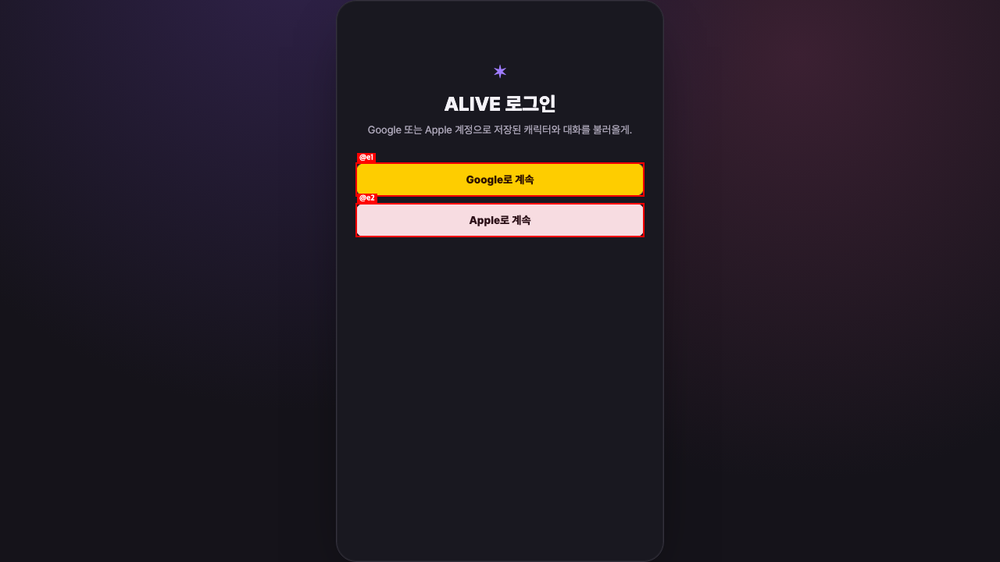
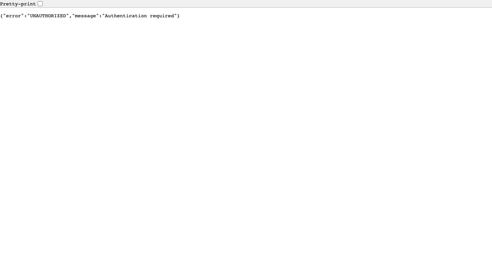

# QA Report: 자동 글쓰기

| Field | Value |
|-------|-------|
| **Date** | 2026-07-24 |
| **URL** | http://localhost:5173/app/feed |
| **Branch** | codex/enhancement |
| **Commit** | 554e27c (2026-07-23) |
| **Tier** | Standard |
| **Scope** | 자동 글쓰기 UI, 백그라운드 예약 실행, 사용 한도 차단 |
| **Duration** | 약 10분 |
| **Pages visited** | 2 |
| **Screenshots** | 2 |
| **Framework** | React SPA + FastAPI |

## Health Score: 93/100

| Category | Score |
|----------|-------|
| Console | 70 |
| Links | 100 |
| Visual | 100 |
| Functional | 85 |
| UX | 100 |
| Performance | 100 |
| Content | 100 |
| Accessibility | 100 |

## Summary

현재 실행 환경에서는 자동 글쓰기가 정상 작동하지 않는다. `하루` 캐릭터는 자동 글쓰기 ON, 15분 주기로 저장되어 있지만 예약 시각이 15시간 57분 지났고 `last_auto_post_at`과 자동 생성 게시글이 없다. 런타임 설정의 `scheduler_enabled` 값은 `False`다.

구성 요소 테스트는 정상이다. 예약 선점, 다음 실행 시각 갱신, 동시 실행 잠금, 지수 백오프, 생성 결과 저장, 실패 문구 미저장, 사용 한도 차단을 포함한 관련 테스트 16개와 백엔드 전체 테스트 76개가 통과했다.

| Severity | Count |
|----------|-------|
| Critical | 0 |
| High | 1 |
| Medium | 0 |
| Low | 0 |
| **Total** | **1** |

## Issues

### ISSUE-001: 실행 환경에서 자동 글쓰기 예약이 처리되지 않음

| Field | Value |
|-------|-------|
| **Severity** | high |
| **Category** | functional |
| **URL** | http://localhost:5173/app/feed |

**Expected:** 자동 글쓰기 ON 상태인 캐릭터는 설정된 15분 주기에 따라 브라우저가 닫혀 있어도 게시글이 생성되고 다음 실행 시각이 갱신되어야 한다.

**Actual:** PostgreSQL 기준 `하루`는 `auto_post_enabled=true`, `auto_post_interval_seconds=900`, `next_auto_post_at=2026-07-23 09:20:44 UTC`지만, 2026-07-24 01:18:10 UTC까지 실행되지 않았다. `last_auto_post_at`은 비어 있고 게시글 수는 0개다. 실행 설정 조회 결과 `scheduler_enabled=False`다.

**Repro Steps:**

1. `http://localhost:5173/app/feed`에 접근한다.
   
2. 별도 QA 브라우저에는 로그인 세션이 없어 로그인 화면으로 이동한다.
3. PostgreSQL에서 자동 글쓰기 ON 캐릭터의 예약 및 실행 상태를 조회한다.
4. 예약 시각이 15시간 57분 지났지만 마지막 실행과 게시글 생성이 없음을 확인한다.

## Console Health

| Error | Count | First seen |
|-------|-------|------------|
| `/api/auth/me` 401 Unauthorized | 2 | http://localhost:5173/app/feed |
| 인증 없이 게시글 API 접근 시 401 | 1 | http://localhost:8000/api/characters/acc_1784796126949/posts |

직접 URL 접근의 인증 경계를 확인한 결과다.

## Verification

| Check | Result |
|-------|--------|
| 프런트엔드 응답 | HTTP 200 |
| 백엔드 응답 | HTTP 200 |
| 자동 글쓰기 런타임 설정 | `scheduler_enabled=False` |
| 자동 글쓰기 예약 지연 | 15:57:25 |
| 자동 글쓰기 관련 테스트 | 16 passed |
| 스케줄러·사용 한도 핵심 테스트 | 8 passed |
| 백엔드 전체 테스트 | 76 passed |
| 코드 변경 | 없음 |

## Status

**DONE_WITH_CONCERNS** — 구성 요소 로직과 테스트는 통과하지만 현재 실행 환경에서는 스케줄러가 비활성화되어 실제 자동 글쓰기가 수행되지 않는다. UI 종단 간 검증은 QA 브라우저에 로그인 세션이 없어 제한됐다.
