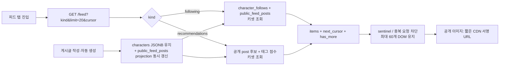

# 다중 사용자 피드 확장성·비용 감사 및 권고안

## 결과

기존 [무한 스크롤 계획](../../plans/product/app-flow/plan_feed-infinite-scroll_2026-08-10.md)의 **화면 20개 분할만 먼저 배포하는 방안은 권고하지 않는다.** 렌더링 수만 줄일 뿐, 서버는 공유 캐릭터 최대 80명과 각 캐릭터의 전체 공개 스냅샷을 60초마다 내려주고 브라우저가 이를 정렬·추천 계산한다. 다중 사용자 환경의 병목은 DOM보다 이 전송·JSON 복제·조회 경로다.

권고안은 다음과 같다.

1. 즉시 저위험 개선으로 전체 탐색 폴링을 피드에서 분리하고, 팔로워 수의 프런트 확장을 제거하며, 관측값과 인덱스를 준비한다.
2. 피드 전용 커서 API와 `public_feed_posts` 읽기 모델을 추가한다. 초기/후속 페이지 모두 20개, `(정렬키, id)` 복합 커서로만 조회한다.
3. 공개 이미지는 짧은 수명의 CDN 서명 URL로 원본 저장소에서 직접 전달한다. API 메모리 프록시는 private DM만 권한 확인 경로로 남긴다.
4. 자동 게시 스케줄러는 웹 API 복제본에서 분리하고 제한된 워커 동시성·대기열 지표·비용 차단기를 둔다.

이는 현재 사용자 기능을 유지하면서 읽기 비용을 결과 개수 `O(20)`으로 제한하고, 데이터가 늘어도 `80 × 게시글 수`에 비례해 증가하는 요청을 없애는 가장 작은 지속 가능한 경로다. CDN/Redis를 개인화 피드 본문에 성급히 적용하지 않는 것도 이 결정의 일부다.

## 2026-08-10 로컬 구현 결과

- `public_feed_posts` projection, backfill, `characters.posts`/공개성 변경 동기화 trigger, 피드·팔로우 조회 인덱스를 추가했다.
- `GET /api/feed`는 `timeline`·`recommendations`, 1–30개 limit, opaque keyset cursor, 현재 사용자·차단·공개성 검사를 처리한다. 클라이언트는 20개만 요청한다.
- 피드 탭의 `/discover/characters` 60초 폴링을 제거하고 `IntersectionObserver`로 다음 cursor만 요청한다. 탭·활성 캐릭터 변경 시 이전 요청은 취소한다.
- 팔로워 수 count를 수만 개의 빈 객체 배열로 확장하던 프런트 경로를 제거했다.
- migration을 실제 staging DB에 적용하고 `EXPLAIN`/payload/브라우저로 확인하는 단계는 아직 실행하지 않았다. 특히 현재 migration의 초기 backfill은 한 트랜잭션이므로 대용량 운영 DB에서는 점검 창 또는 배치 backfill 계획이 필요하다.

## 범위와 판단 기준

- 대상: 추천·팔로잉 피드, 공개 게시글·이미지 전달, 자동 게시의 부하와 생성 비용
- 제외: 추천 모델 고도화, 제품 KPI 변경, 기존 게시글 JSON의 즉시 삭제, 실제 운영 DB에 대한 부하 실행
- 사실은 현재 저장소 정적 분석과 단위 테스트에서 확인했다. 실제 p95, 전송량, DB 실행 계획은 현재 수집되지 않아 **미확인**이다.
- 외부 패턴은 GitHub의 페이지별 응답/다음 링크 관례, PostgreSQL의 실행 계획·인덱스 검증, CDN의 private 캐시 규칙, CloudFront의 짧은 서명 URL을 참고했다. [GitHub pagination](https://docs.github.com/en/rest/using-the-rest-api/using-pagination-in-the-rest-api?apiVersion=2022-11-28), [PostgreSQL EXPLAIN](https://www.postgresql.org/docs/current/using-explain.html), [PostgreSQL indexes](https://www.postgresql.org/docs/current/indexes.html), [Cloudflare cache control](https://developers.cloudflare.com/cache/concepts/cache-control/), [CloudFront signed URLs](https://docs.aws.amazon.com/AmazonCloudFront/latest/DeveloperGuide/private-content-signed-urls.html)

## 현재 상태와 근거

| 구간 | 확인된 사실 | 다중 사용자 영향 |
|---|---|---|
| 탐색 API | `SharedCharacterRepository._shared_characters()`가 공개 캐릭터 80개를 정렬해 반환하고, DTO에 `character` 전체와 `character.posts`를 포함한다. | 한 요청이 캐릭터 수와 스냅샷 크기에 비례한다. 제한 80은 상한일 뿐 페이지네이션이 아니다. |
| 클라이언트 피드 | `useAliveFeed`가 수신한 전 캐릭터의 글을 `flatMap`, 정렬, 추천 점수 계산 후 렌더한다. | 20개만 보이게 해도 수신·파싱·정렬·메모리 사용량은 그대로다. |
| 갱신 | 피드 화면에서도 `useAliveDiscoverSync`가 즉시 전체 탐색을 호출하고 60초 폴링한다. | 활성 피드 사용자 수에 비례해 같은 큰 읽기 요청이 반복된다. |
| 게시글 저장 | `Character.posts` JSONB 전체를 잠근 뒤 교체하고, 공개 시 동일 게시글·갤러리·팔로잉을 `SharedCharacter.character` JSONB에 다시 복제한다. | 쓰기 증폭, 행 크기 증가, 읽기 전송량 증가가 함께 발생한다. |
| 팔로워 수 | 서버는 count map을 반환하지만 프런트 `followerRowsForCounts()`는 count 수만큼 빈 행 배열을 만든다. | 네트워크는 작지만 인기 캐릭터에서 브라우저 CPU/힙이 팔로워 수에 비례한다. |
| 미디어 | API가 S3 객체 전체를 `bytes`로 읽어 하나의 `StreamingResponse`로 전달한다. | 앱 서버 메모리·대역폭·동시 연결이 이미지 바이트에 비례한다. |
| 자동 게시 | 스케줄러는 claim batch의 생성을 순차 실행한다. API 프로세스 수를 늘리면 각 프로세스가 스케줄러도 시작한다. | backlog는 커지고, API 확장과 작업 확장이 결합된다. `SKIP LOCKED`는 중복 claim을 완화하지만 운영 소유권을 분리하지 않는다. |
| 생성 비용 | 자동 게시는 최대 24회/일 정책이며, 최대 예약 비용은 fast 정책 기준 호출당 최대 `$0.030`(재시도 2회 포함)이다. | 활성 자동 게시 캐릭터 하나의 이론상 상한은 `$0.72/일`이다. 실제 비용은 provider usage가 금액으로 계산되지 않아 보수적 예약값으로만 관리된다. |

코드 근거: [`shared_characters.py`](../../../backend/app/repositories/shared_characters.py#L23), [`useAliveFeed.ts`](../../../apps/frontend/src/hooks/useAliveFeed.ts#L128), [`useAliveDiscoverSync.ts`](../../../apps/frontend/src/hooks/useAliveDiscoverSync.ts#L63), [`character_posts.py`](../../../backend/app/repositories/character_posts.py#L24), [`discover.ts`](../../../apps/frontend/src/api/discover.ts#L125), [`media.py`](../../../backend/app/api/v1/media.py#L59), [`auto_post_scheduler.py`](../../../backend/app/services/auto_post_scheduler.py#L36), [`credit_policy.py`](../../../backend/app/core/credit_policy.py#L35).

### 수치화해야 할 현재 미확인값

다음 SQL과 API 계측을 먼저 배포 환경에서 수집한다. 이 값 없이 pool 크기, Redis 도입, 인스턴스 수를 정하면 비용만 증가할 가능성이 크다.

```sql
-- 공개 피드 원천의 실제 크기와 복제 비용
SELECT count(*) AS public_characters,
       percentile_cont(0.95) WITHIN GROUP (ORDER BY pg_column_size(character)) AS p95_shared_character_bytes
FROM shared_characters;

SELECT percentile_cont(0.95) WITHIN GROUP (ORDER BY jsonb_array_length(posts)) AS p95_posts_per_character,
       max(jsonb_array_length(posts)) AS max_posts_per_character
FROM characters
WHERE is_public;

-- 인덱스 적용 전/후 실제 계획: 운영에서는 표본 계정으로만 실행
EXPLAIN (ANALYZE, BUFFERS, FORMAT JSON) SELECT ...;
```

`EXPLAIN ANALYZE`는 실제 실행 시간과 행 수를 보여 주므로 추정 비용만으로 인덱스를 결정하지 않아야 한다. PostgreSQL도 인덱스는 읽기를 빠르게 할 수 있지만 쓰기 오버헤드가 있으므로 사용을 검증하라고 안내한다. [EXPLAIN](https://www.postgresql.org/docs/current/using-explain.html), [indexes](https://www.postgresql.org/docs/current/indexes.html)

## 비판: 기존 계획에서 유지할 것과 바꿀 것

| 기존 결정 | 판정 | 이유와 수정 |
|---|---|---|
| 첫 20개·하단 감지 | 유지 | 모바일 인지 부하와 첫 화면 렌더를 줄인다. 단, API도 반드시 20개만 반환해야 한다. |
| 클라이언트 배열만 20개로 절단 | 폐기 | 네트워크·DB·JS 정렬 비용을 줄이지 못한다. 임시 UI 개선으로만 허용되며 성능 최적화 완료로 표기하면 안 된다. |
| 서버 커서 페이지네이션을 후속 단계로 분리 | 순서 변경 | 다중 사용자 목표에서는 서버 커서 API가 1차다. UI sentinel은 그 API 위에서 구현한다. |
| 전체 탐색 80개를 추천 후보로 사용 | 폐기 | 80개 상한은 최신성·추천 품질을 왜곡하고, 사용자 수 증가 시 고정된 hot set만 노출한다. 후보 선택을 서버 읽기 모델로 옮긴다. |
| 새 외부 라이브러리 없음 | 조건부 유지 | React Query/Redis는 현재 필수가 아니다. `fetch`+AbortController+작은 hook과 PostgreSQL 읽기 모델로 먼저 해결하고, 지표가 증명할 때만 추가한다. |

## 권장 목표 아키텍처



### API 계약

`GET /api/feed?kind=following|recommendations&source_account_id={id}&limit=20&cursor={opaque}`

```json
{
  "items": [{ "id": "...", "author": {}, "text": "...", "createdAt": "...", "likeCount": 0, "comments": [] }],
  "nextCursor": "opaque-or-null",
  "hasMore": true,
  "feedVersion": "v1"
}
```

- `limit`은 서버에서 `1..30`으로 clamp한다. 클라이언트는 20만 요청한다.
- 커서는 base64url 인코딩한 `{feedVersion, sortKey, createdAt, id}`를 서버 비밀로 HMAC 서명한다. 클라이언트가 임의 offset·다른 정렬을 주입하거나 같은 항목을 반복시키지 못한다.
- 팔로잉은 `(created_at DESC, id DESC)` 키셋이다. 추천은 `(score DESC, created_at DESC, id DESC)`이며 커서에 프로필/랭킹 버전을 넣는다. 프로필·팔로우가 변하면 첫 페이지부터 새 버전을 시작한다.
- `hasMore`는 `limit + 1` 조회로 계산한다. 무한 스크롤은 `nextCursor === null`에서 observer를 해제한다.
- 차단·공개 상태·댓글/좋아요 권한은 기존 서버 권한 경로를 조회 전에 적용한다. 개인화 응답은 `Cache-Control: private, no-store`다. `private`는 공유 CDN 캐시에 저장되면 안 된다는 의미다. [Cloudflare Cache-Control](https://developers.cloudflare.com/cache/concepts/cache-control/)

### 영속화: 즉시 교체가 아닌 읽기 모델 추가

기존 `characters.posts` JSONB를 이번 작업에서 제거하지 않는다. 호환성을 보장하기 위해 아래 `public_feed_posts` projection을 추가하고, `append_generated_post`, 수동 저장, 댓글 추가, 공개/비공개 전환과 **같은 트랜잭션**에서 갱신한다.

| 열 | 용도 |
|---|---|
| `id` (현재 post UUID 문자열) | 안정적인 tie-breaker 및 기존 액션 호환 |
| `author_character_id`, `author_shared_character_id` | 팔로잉 join과 공개성 권한 |
| `owner_id`, `created_at`, `visibility` | 차단·키셋·공개 제외 |
| `text`, `mood`, `media_asset_id`, `payload` | 카드 렌더에 필요한 작은 projection. `payload`는 과도기 호환 전용 |
| `comments_preview`, `comment_count`, `like_count` | 목록 카드가 전체 댓글/좋아요를 별도 N+1 없이 보이게 하는 요약 |

필수 인덱스 후보는 다음이다. 실제 `EXPLAIN (ANALYZE, BUFFERS)`로 선택성이 확인될 때만 concurrent migration으로 적용한다.

```sql
CREATE INDEX CONCURRENTLY ix_public_feed_posts_author_created
  ON public_feed_posts (author_shared_character_id, created_at DESC, id DESC)
  WHERE visibility = 'public';
CREATE INDEX CONCURRENTLY ix_character_follows_target_created
  ON character_follows (target_shared_character_id, created_at DESC);
CREATE INDEX CONCURRENTLY ix_auto_posts_due
  ON characters (next_auto_post_at)
  WHERE auto_post_enabled AND next_auto_post_at IS NOT NULL;
```

이 설계는 대규모 follower fan-out 테이블을 미리 만들지 않는 **fan-out on read**다. 현재 제품의 팔로우 수·게시 빈도에서는 쓰기 폭발을 피하고, 읽기는 limit 20과 인덱스로 제한된다. 유명 캐릭터의 읽기 p95가 목표를 지속 초과할 때만 5분 TTL의 사용자별 후보 캐시 또는 materialized fan-out을 별도 ADR로 검토한다.

### 프런트 구현 규칙

- `useAliveFeed`에서 추천·팔로잉의 전체 배열 계산을 없애고 `useInfiniteFeed(kind, activeId)`로 소유권을 분리한다.
- 탭/활성 캐릭터/`feedVersion`이 바뀌면 AbortController로 이전 요청을 취소하고 `{items, cursor, hasMore, loading}`을 원자적으로 초기화한다.
- observer가 교차해도 `loading || !hasMore`이면 요청하지 않는다. cursor별 요청 키로 재진입과 중복 append를 막는다.
- 카드 `key`는 API post ID이며 `Set`으로 dedupe한다. 최신 글이 첫 페이지 위에 추가되어도 진행 중인 커서 페이지를 섞지 않는다. 새 글 배지는 재조회 후 첫 페이지에서만 반영한다.
- 첫 20개 이후에도 장시간 스크롤에서는 최대 60개 카드만 DOM에 유지하거나 검증된 가상화 도입을 별도 작업으로 한다. 이미 불러온 모든 카드를 계속 DOM에 쌓는 것은 또 다른 렌더링 병목이다.
- 이미지에 `loading="lazy"`, `decoding="async"`, 확정 aspect ratio를 적용한다. 목록 API에는 원본 bytes 대신 asset reference/서명 URL만 담는다.

### 미디어와 캐시

현재 API는 public image도 S3에서 전부 읽어 앱 서버로 전달한다. 공개 피드 이미지에 한해 권한 확인 뒤 5~10분 만료의 CloudFront 서명 URL을 반환하고 브라우저가 edge cache에서 직접 읽게 한다. 서명 URL은 만료·정책을 포함해 제한된 기간의 private object 전달에 사용할 수 있다. [CloudFront signed URLs](https://docs.aws.amazon.com/AmazonCloudFront/latest/DeveloperGuide/private-content-signed-urls.html)

DM/private asset은 현행 권한 검사를 유지하고 `no-store`로 둔다. 공개 asset도 사용자 차단이 곧바로 미디어 권한 취소여야 한다면 짧은 TTL(예: 5분)과 삭제/차단 시 원본 무효화가 필요하다. 따라서 **피드 JSON을 CDN 공유 캐시하는 것은 금지**하고, 불변에 가까운 image byte만 edge 전달 대상으로 한다.

### 자동 게시·AI 비용

| 위험 | 조치 |
|---|---|
| 웹 replica마다 scheduler 실행 | API container에서는 `AUTO_POST_SCHEDULER_ENABLED=false`; 단일 작업 worker가 scheduler를 소유한다. HA가 필요하면 리더 선출/작업 큐를 추가하고 웹과 worker를 분리한다. |
| batch가 순차 생성 | worker에 provider quota보다 작은 고정 동시성(초기 3~5)을 둔다. backlog age, 성공/실패, retry, provider 429를 지표로 조정한다. 무제한 `gather`는 금지한다. |
| 무료 자동 생성의 비용 노출 | 사용자별 24회/일 외에 전역 provider 일/월 예산, worker rate limit, 자동 게시 기본 opt-in 정책을 둔다. 월 예산의 단일 DB 행 잠금은 AI QPS가 높아지면 경합점이므로 lock wait를 계측한다. |
| 예약값과 실제 비용의 차이 | provider token usage는 기록하지만 현재 USD는 측정되지 않는다. 가격표 버전과 입력/출력/사고 토큰을 일별 집계해 예약 상한·실제 추정치를 분리한다. 가격을 코드 상수로 장기간 고정하지 않는다. |

SQLAlchemy async engine은 기본 async queue pool을 사용한다. 따라서 `pool_size`/`max_overflow`를 추측으로 키우지 말고 DB max connection, replica 수, pool checkout 대기, query p95를 함께 보고 설정한다. [SQLAlchemy async pooling](https://docs.sqlalchemy.org/en/21/core/pooling.html)

## 단계별 개발·검증 계획

### P0 — 출시 전 보호막 (작은 변경)

- [ ] `followerRowsForCounts()`를 제거하고 `Record<sharedId, number>`을 그대로 상태에 합친다.
- [ ] 피드 진입 시 `loadSharedCharacters()`와 60초 전체 탐색 폴링을 중단한다. discovery 화면만 별도 cursor endpoint를 사용한다.
- [ ] API middleware에 route, status, duration, response bytes, DB pool wait, request ID 구조 로그를 추가한다. PII·본문은 기록하지 않는다.
- [ ] `character_follows(target_shared_character_id, created_at DESC)`와 auto-post due index 후보를 staging의 실행 계획으로 검증한다.
- [ ] 임계값 알림: feed API p95/p99, 5xx, payload p95, DB pool wait, scheduler backlog age, AI reserved USD/day.

완료 조건: 기존 동작 테스트가 유지되고, 피드 화면의 `/discover/characters` 반복 호출이 0이며, follower count가 큰 fixture에서도 배열 확장이 없다.

### P1 — 서버 페이지네이션 (핵심 변경)

- [ ] migration으로 projection과 인덱스를 만들고 JSONB에서 backfill한다. backfill은 작은 batch·재시작 가능 checkpoint로 실행한다.
- [ ] 쓰기 경로를 dual-write하고 backfill count/해시를 비교한다. mismatch가 있으면 새 읽기 경로를 켜지 않는다.
- [ ] `GET /feed` 두 kind, opaque cursor, block/public 권한, next page 중복 방지 테스트를 구현한다.
- [ ] 프런트의 `useInfiniteFeed`와 sentinel을 구현하고 accessibility 상태(`role=status`, 종료 문구, 재시도)를 검증한다.
- [ ] feature flag로 내부 사용자 → 5% → 25% → 100% 순서로 전환한다. 각 단계에서 old/new 첫 페이지 ID와 count를 shadow compare한다.

완료 조건: 20개 초과 게시글이 있는 fixture에서 첫 응답과 DB 읽기 행 수가 페이지 크기로 제한되고, cursor 경계의 동률 timestamp·새 글 삽입·탭 전환에서 중복/누락이 없다.

### P2 — 미디어·작업 분리 (부하/비용 변화가 확인될 때)

- [ ] 공개 image CDN signed URL, private asset 무효화·감사 조건을 보안 리뷰한다.
- [ ] worker 분리, bounded concurrency, provider rate/backoff, backlog dashboard를 배포한다.
- [ ] 실제 token usage 기반 비용 추정과 전역 예산 알림을 추가한다.

완료 조건: 앱 서버의 image egress/메모리와 scheduler가 API p95에 영향을 주지 않으며, provider 비용이 일별 예산 안에서 관측된다.

## 검증 설계

| 층 | 필수 검증 | 통과 기준 |
|---|---|---|
| 단위 | cursor encode/decode·서명·limit clamp·동률 정렬·block/비공개·follower count map | 경계/변조 cursor는 400, 동일 item 중복 없음 |
| repository | following/recommendation query의 `EXPLAIN` snapshot | 100k 공개 post/충분한 follow fixture에서 limit 후 full sort·sequential scan이 없거나 근거가 있음 |
| API | `items/nextCursor/hasMore`, authorization, dual-write/backfill | old/new 정상 fixture 동등, private·blocked content 0건 |
| 브라우저 | 탭 전환, 빠른 스크롤, offline/retry, screen reader 종료 상태 | 한 cursor당 한 요청, cancel 이후 stale append 0건 |
| 부하 | k6/Locust로 100 VU부터 현재 peak의 2배까지 단계 상승 | feed endpoint p95 ≤ 300ms, p99 ≤ 800ms, 5xx < 0.5%, DB pool wait p95 ≤ 50ms. 실제 트래픽이 낮으면 이 기준은 staging SLO로만 사용 |
| 비용 | 24회 자동 게시, provider 429, 재시도, 월 예산 직전 | 예약/환불이 한 번만 반영되고 queue backlog·예산 초과가 관측됨 |

부하 테스트는 이미 실행 중인 staging process에서만 수행한다. 이 저장소 지침에 따라 이번 감사에서는 새 프런트/백엔드 프로세스를 시작하거나 운영 데이터를 변경하지 않았다.

## 이번 검증 결과

- `npm run typecheck`: passed
- `npm run test:domain`: passed — 143 tests
- `backend/.venv/bin/python -m pytest -q tests/test_shared_characters_api.py tests/test_character_posts_repository.py tests/test_auto_post_scheduler.py tests/test_feed_generation.py`: passed — 34 tests
- API/DB 실제 payload, `EXPLAIN ANALYZE`, 브라우저, CDN, 부하 테스트: not run — 실행 중인 staging/운영 환경과 계측값이 제공되지 않았다.

## 변경 파일

- `documents/reports/backend/report_feed-scalability-cost-audit_2026-08-10.md`: 현재 피드 계획의 확장성·비용 감사, 비판, 목표 계약, 단계별 검증 조건
- `documents/reports/backend/README.md`: 보고서 색인 추가

## 남은 위험

1. JSONB 원본과 projection의 dual-write/backfill 불일치가 피드 누락으로 이어질 수 있다. feature flag와 shadow comparison 없이 전환하면 안 된다.
2. 공유 캐시를 개인화 피드 또는 차단 대상 미디어에 적용하면 타 사용자 콘텐츠가 노출될 수 있다.
3. 자동 게시 worker의 동시성을 provider quota보다 높이면 비용 폭증·429 재시도가 발생할 수 있다.
4. 운영 규모의 query plan과 payload 분포가 없으므로 제시한 SLO/인덱스는 검증 전 가설이다.

## 다음 추천 작업

1. P0의 follower count 확장 제거와 feed 폴링 분리를 별도 작은 Change 작업으로 구현한다.
2. P1 전에 `public_feed_posts` migration/API contract ADR을 확정하고, staging에서 100k 공개 post fixture와 `EXPLAIN` 증거를 수집한다.
