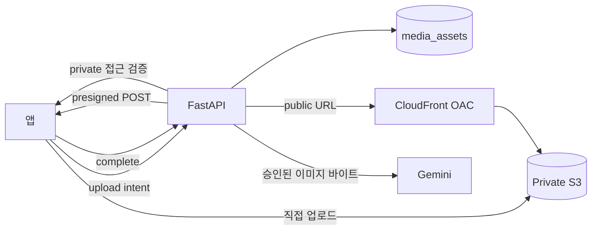

# S3 이미지 스토리지 전환 개발 명세

## 결정

Base64를 DB·로컬 상태에 저장하는 방식을 중단한다. **비공개 S3 버킷 + CloudFront + `media_assets` + 앱의 직접 업로드**로 전환한다.

- DB에는 S3 URL이 아니라 `asset_id`를 저장한다.
- 공개 프로필·공개 게시글은 CloudFront URL로 전달한다.
- DM과 비공개 갤러리는 인증된 API가 짧은 만료 URL을 발급하거나 다운로드를 중계한다.
- S3 버킷은 공개하지 않는다. CloudFront Origin Access Control(OAC)만 읽을 수 있게 한다.
- AI 요청은 `asset_id`를 받아 서버가 소유권 확인 후 객체 바이트를 Gemini 입력으로 전달한다.

현재 AI 구현은 `data:...;base64`만 이미지 입력으로 처리한다. URL만 저장하도록 바꾸면 DM·생성 문맥의 이미지가 빠지므로 AI 작업은 필수 범위다.

## 범위

| 이미지 종류 | 현재 | 전환 후 |
|---|---|---|
| 아바타·헤더 | `avatarImg`, `headerImg` Base64 | `asset_id` |
| 갤러리 | Base64 배열 | `asset_id` 배열 |
| 게시글 | `post.img` Base64 | `asset_id` |
| DM | `message.img` Base64 | private `asset_id` |
| 프로필 백업·로컬 상태 | 이미지 원문 복제 | asset 참조만 저장 |

대상 경로는 `useCharacterAccounts.ts`, `useAliveDm.ts`, `useAliveDmGeneration.ts`, `useAliveFeedGeneration.ts`, `useAliveAppStatePersistence.ts`, `entities.py`, `characters.py`, `profile_state.py`, `ai.py`다.

## 대안과 선택 이유

| 선택지 | 판단 |
|---|---|
| **S3 + CloudFront** | **채택.** public 피드와 private DM을 분리하고, IAM·수명주기·삭제·AI 서버 접근을 안정적으로 운영할 수 있다. |
| Cloudflare R2 | public 읽기 트래픽이 비용의 대부분이 되면 재검토한다. egress 무료지만 요청 과금이 있고, presigned HTML form POST를 지원하지 않아 업로드 정책이 달라진다. |
| Cloudinary 등 관리형 이미지 서비스 | 다양한 크롭·포맷 변환이 제품 핵심이 된 뒤 검토한다. 초기 개발은 빠르지만 비용·공급자 의존성이 커진다. |
| FastAPI 경유 업로드 | 앱 → API → S3로 파일이 두 번 이동해 서버 대역폭과 지연이 늘어난다. 운영 기본 경로로 채택하지 않는다. |
| S3 URL 직접 저장 | URL 만료, private 접근, CDN 교체, 삭제 처리와 강결합된다. 채택하지 않는다. |

## 목표 흐름

## 데이터와 API 계약

### `media_assets`

| 필드 | 규칙 |
|---|---|
| `id` UUID | 앱과 기존 JSONB가 참조하는 유일한 ID |
| `owner_id`, `character_id` | 업로드·연결 권한 기준 |
| `purpose` | `profile_avatar`, `profile_header`, `gallery`, `feed_post`, `dm_attachment` |
| `visibility` | `public` 또는 `private`; 클라이언트가 임의 지정하지 못한다 |
| `status` | `pending`, `ready`, `rejected`, `deleted` |
| `storage_key` | UUID 기반 키. 원본 파일명·개인정보 금지 |
| `content_type`, `byte_size`, `sha256`, `width`, `height` | 완료 검증과 감사 정보 |

기존 JSONB는 `asset_id`만 저장한다. API 응답에서만 `delivery_url`을 추가한다. 예: `{ "asset_id": "...", "delivery_url": "..." }`.

### API

| API | 역할 | 성공 조건 |
|---|---|---|
| `POST /api/media/upload-intents` | 용도·소유권·MIME·크기·quota를 검증하고 `pending` asset과 짧은 만료 presigned POST를 발급 | 요청자는 자기 캐릭터에만 업로드할 수 있다 |
| `POST /api/media/{asset_id}/complete` | S3 객체의 존재·MIME·크기·checksum을 재검증하고 `ready` 전환 | 검증 실패 객체는 `rejected` |
| `GET /api/media/{asset_id}/access` | private asset의 소유자·DM 참여자를 확인하고 제한된 접근을 제공 | 비참여자는 403 |
| 기존 캐릭터·게시글·DM 저장 API | `ready`이고 요청자가 연결 권한을 가진 asset만 허용 | Base64와 타인 asset은 400/403 |

초기 허용 형식은 JPEG·PNG·WebP다. SVG·GIF·HEIC는 별도 정책 전까지 거절한다. 시작 한도는 프로필·갤러리·게시글 10 MB, DM 5 MB이며 디코딩 후 픽셀 수도 제한한다.

## 개발 작업

| 순서 | 작업 | 영역 | 선행 조건 | 완료 기준 |
|---|---|---|---|---|
| 1 | S3 버킷, CORS, Block Public Access, CloudFront OAC, 최소 IAM 정책 구성 | 인프라 | AWS 계정·리전 결정 | S3 직접 공개 URL은 403이고 CloudFront 공개 asset만 200이다 |
| 2 | `media_assets` 모델·마이그레이션·저장소 추가 | 백엔드/DB | 1 | UUID, 소유자, 상태, metadata가 저장된다 |
| 3 | upload intent·complete·private access API 구현 | 백엔드 | 1, 2 | 타인 업로드/연결, 만료, 불일치 MIME·크기가 거절된다 |
| 4 | 프런트 공통 업로드 함수와 업로드 상태 UI 추가 | 프런트 | 3 | 선택한 파일이 Base64 없이 asset 참조로 전환되고 실패·취소·재시도가 보인다 |
| 5 | 프로필·갤러리·게시글·DM을 asset 참조로 순차 전환 | 프런트/백엔드 | 4 | 새 저장 payload에 `data:` 문자열이 없다 |
| 6 | AI에서 `asset_id` 권한 확인 후 S3 객체를 Gemini 입력으로 변환 | 백엔드 | 2, 5 | DM 참여자만 이미지를 AI 문맥에 전달할 수 있다 |
| 7 | legacy Base64와 asset 참조 이중 읽기 배포 | 프런트/백엔드 | 5, 6 | 기존 이미지와 신규 이미지가 함께 렌더된다 |
| 8 | 서버 데이터 이전·재실행 ledger·로컬 잔여 이미지 처리 | 백엔드/프런트 | 7 | 실패한 항목만 재시도되고 원본 데이터는 성공 전 유지된다 |
| 9 | 신규 Base64 쓰기 차단, 고아 객체·계정 삭제 정리 작업 추가 | 백엔드/운영 | 8 | 모든 저장 API가 `data:`를 거절하고 삭제 후 객체가 유예 기간 뒤 제거된다 |

## 마이그레이션과 롤백

1. 새 구조를 먼저 배포하되, 화면은 기존 `data:`와 `asset_id`를 모두 읽는다.
2. 신규 이미지는 asset 방식으로만 쓴다.
3. 캐릭터·갤러리·게시글·공유/팔로우 스냅샷·DM·`Profile.app_state`를 항목 단위로 이전한다.
4. 각 항목은 `업로드 → checksum 확인 → asset ready → 참조 교체`를 ledger에 기록한다. 실패하면 Base64를 유지하고 재시도한다.
5. 기기에만 있는 Base64는 서버에서 볼 수 없다. 다음 동기화 때 업로드하거나 사용자 재선택 안내 중 하나를 제품 결정으로 확정한다.
6. 이전율과 오류율이 기준을 충족한 뒤에만 `data:` 쓰기를 차단한다.

롤백은 새 쓰기를 중지하고 이중 읽기를 유지하는 방식이다. 이전 성공 전 Base64를 삭제하지 않으며, asset 참조를 제거해도 원본 객체는 즉시 삭제하지 않고 유예 기간을 둔다.

## 테스트와 배포 기준

### 자동화

- backend: intent 소유권, `ready` 전 연결 차단, 타인 asset·DM 비참여자 거절, MIME/크기/checksum 불일치, `data:` 차단, 삭제 정리
- frontend: 파일 선택 뒤 Base64를 상태·백업에 남기지 않음, 업로드 실패·취소·재시도, legacy/new 이미지 동시 렌더
- AI: 승인된 asset이 Gemini 요청에 포함되고 권한 없는 asset은 포함되지 않음
- migration: 중단·재실행·손상 Base64·중복·일부 실패

### 수동 통합

- 웹과 Capacitor iOS/Android에서 CORS 직접 업로드
- 공개 이미지는 CloudFront로 노출되고 S3 URL은 접근 불가
- private DM은 대화 참여자가 아니면 접근 불가
- 아바타 교체·게시글 삭제·캐릭터/계정 삭제 뒤 캐시와 객체 정리 확인

배포는 **1~3 → 4~6 → 7 → 8 → 9** 순서다. 각 단계에서 업로드 성공률, 이미지 렌더 오류율, API 응답 크기, S3·CloudFront 요청/전송량, 고아 객체 수를 확인한다.

## 나중에 도입할 항목

이미지 처리량 또는 디자인 요구가 실제로 커질 때만 도입한다.

- S3 이벤트 + SQS 워커로 EXIF 제거·WebP/AVIF 변환·썸네일 생성
- private DM의 CloudFront signed URL/cookie
- 악성 파일 검사와 이미지 moderation
- R2 또는 관리형 이미지 서비스 비교 PoC

## 근거

- [AWS S3 presigned URL](https://docs.aws.amazon.com/AmazonS3/latest/userguide/using-presigned-url.html) 및 [POST 정책 조건](https://docs.aws.amazon.com/AmazonS3/latest/developerguide/sigv4-HTTPPOSTConstructPolicy.html)
- [AWS S3 CORS](https://docs.aws.amazon.com/AmazonS3/latest/userguide/cors.html), [CloudFront OAC](https://docs.aws.amazon.com/AmazonCloudFront/latest/DeveloperGuide/private-content-restricting-access-to-s3.html)
- [Cloudflare R2 가격](https://developers.cloudflare.com/r2/pricing/) 및 [presigned URL 제약](https://developers.cloudflare.com/r2/api/s3/presigned-urls/)
- [Cloudinary private delivery](https://cloudinary.com/documentation/image_upload_api_reference)
- [Gemini 이미지 입력](https://ai.google.dev/gemini-api/docs/image-understanding)
