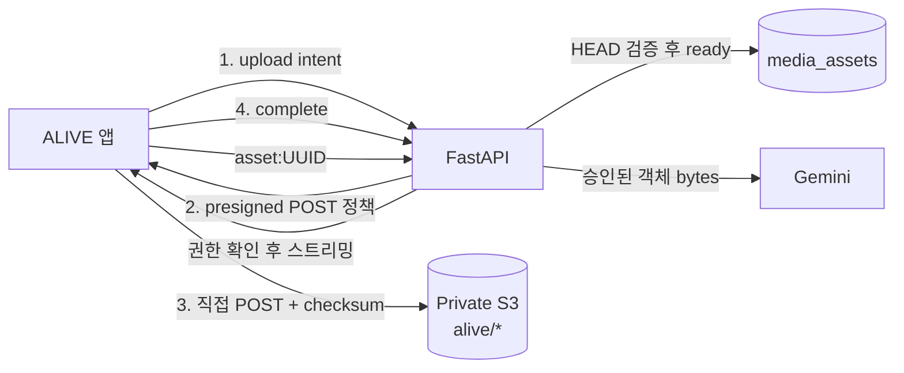

# S3 이미지 스토리지 전환 실행 명세

## 결론

새 이미지 저장은 Base64 대신 기존 `game-asset-generator`가 사용하는 S3 패턴을 따라 구현했다. 앱은 API에서 짧게 만료되는 **presigned POST 정책**을 받고 S3에 직접 업로드한다. GAG는 PUT을 사용하지만, ALIVE는 S3가 업로드 용량을 강제할 수 있도록 POST를 선택했다. DB와 기존 JSON에는 S3 URL이나 Base64 원문 대신 `asset:<UUID>` 참조만 남긴다.

이번 단계의 실제 전달 경로는 **ALIVE 인증 API → 비공개 S3**다. CloudFront는 아직 구성하지 않았으며, 공개 피드의 대역폭·캐시 비용이 실제 병목이 된 뒤 별도 단계로 도입한다. 여기서 `public`은 인터넷 공개가 아니라 **로그인한 ALIVE 사용자가 볼 수 있는 공개 프로필/피드 자산**이라는 제품 권한이다.

## 기존 GAG를 확인해 반영한 사항

현재 공유 중인 `game-asset-generator`는 다음 방식으로 운영된다.

- Lightsail 배포의 `infra/compose/docker-compose.prod.yml`이 `S3_BUCKET`, `S3_REGION`, `S3_ACCESS_KEY_ID`, `S3_SECRET_ACCESS_KEY`를 백엔드 컨테이너에 전달한다.
- GitHub Actions 배포는 서버의 비공개 `.env.prod`를 `docker compose --env-file .env.prod`로 사용한다. 키를 Git이나 프런트 환경 변수에 넣지 않는다.
- FastAPI가 `boto3.generate_presigned_url("put_object")`로 PUT 업로드 URL을 발급하고, 키를 `uploads/{user_id}/{uuid}` 형태로 제한한다.
- 생성 이미지와 다운로드는 서버가 S3를 읽어 처리하거나 제한 시간 URL을 발급한다.

ALIVE도 변수명과 Lightsail 배포 방식은 그대로 호환되게 두고, 같은 버킷 안에서는 GAG의 `generated/`, `uploads/`와 충돌하지 않는 `alive/` 접두사를 사용한다. 현재 콘솔에서 확인된 버킷은 `game-asset-2026`, 리전은 서울(`ap-northeast-2`)이며 퍼블릭 액세스 차단이 켜져 있다.

> 현재 GAG의 IAM 사용자는 `AmazonS3FullAccess`가 연결되어 있어 기능상 그대로 사용할 수 있다. 다만 이 권한은 ALIVE 전용으로는 과도하다. 기존 GAG에 영향을 주지 않기 위해 지금 변경하지 않고, 안정화 뒤 `alive/*`만 허용하는 전용 IAM 사용자 또는 역할로 분리한다.

## 현재 구현 상태

### 저장 모델과 권한

`media_assets` 테이블과 마이그레이션을 추가했다. 자산의 소유자·캐릭터·용도·상태·S3 키·MIME·크기·SHA-256을 서버가 관리한다.

| 구분 | DB/JSON에 저장하는 값 | 접근 정책 |
|---|---|---|
| 프로필 헤더·아바타·갤러리·피드 | `asset:<UUID>` | 로그인한 ALIVE 사용자 및 소유자. 피드/팔로우 흐름에서 이미지를 보여야 하므로 이 단계에서는 `public`으로 분류 |
| DM 첨부 | `asset:<UUID>` | 소유자 또는 해당 DM 대화 참여자만 접근 가능 |
| 기존 이미지 | 기존 `data:` 문자열 | 이중 읽기로 계속 표시. 아직 일괄 이전·차단하지 않음 |

S3 객체 키는 `alive/users/{owner_uuid}/{purpose}/{asset_uuid}.{ext}`다. 원본 파일명과 사용자 입력 경로를 사용하지 않는다.

### API와 실제 흐름



| API | 현재 역할 |
|---|---|
| `POST /api/media/upload-intents` | JPEG/PNG/WebP, 최대 10MB, 캐릭터 소유권을 확인하고 S3가 용량까지 강제하는 presigned **POST** 정책을 발급 |
| `POST /api/media/{asset_id}/complete` | S3 `HEAD`, 이미지 포맷·픽셀 수·크기·MIME·checksum을 검증한 뒤에만 `ready`로 전환 |
| `GET /api/media/{asset_id}/content` | 소유자, public 자산 또는 `thread_key`로 확인된 DM 참여자에게만 S3 객체를 스트리밍 |
| `GET /api/media/{asset_id}/access` | 필요 시 제한된 접근 정보를 발급하는 서버 API. 현재 프런트 렌더는 `content`를 사용 |

프런트의 프로필·갤러리·DM 업로드는 새 공통 업로더를 사용하며, 파일을 `FileReader`로 Base64화하지 않는다. 렌더링은 `asset:<UUID>`를 `/api/media/{id}/content`로 바꾸고, 기존 Base64도 그대로 읽는다. 캐릭터·피드·DM 저장 시에도 서버가 `asset:` 참조의 소유자·용도·ready 상태를 검증한다. AI는 `asset:<UUID>`를 권한 확인 뒤에만 S3에서 읽어 Gemini가 이해하는 data URL로 내부 변환한다.

## CloudFront를 지금 넣지 않는 이유

CloudFront + OAC는 S3를 비공개로 유지하면서 공개 이미지의 캐시·전송비를 줄이는 좋은 다음 단계다. 하지만 이번 구현에서 이미지 접근은 ALIVE 로그인/DM 참여 권한과 결합되어 있고, 현재 트래픽 규모도 검증 전이다. 지금 CDN을 함께 붙이면 캐시 무효화, public/private URL 분기, 배포 설정까지 동시에 늘어난다.

따라서 지금은 API 중계로 권한 모델을 먼저 안정화한다. 피드 이미지 트래픽 또는 API egress가 늘어나는 지표가 보이면 public 자산만 CloudFront OAC origin으로 옮기고, DM은 API 또는 CloudFront signed URL/cookie를 별도 설계한다. 이 전환에서도 DB의 `asset:<UUID>` 참조는 그대로 유지된다.

## 배포 전 필요한 설정

1. **ALIVE Lightsail 서버의 비공개 `.env.prod`**에 기존 S3 자격 증명과 아래 값을 넣는다. `.env.prod`, 액세스 키, 시크릿은 절대 Git/Vite 변수에 넣지 않는다.

   ```env
   S3_BUCKET=game-asset-2026
   S3_REGION=ap-northeast-2
   S3_ACCESS_KEY_ID=...
   S3_SECRET_ACCESS_KEY=...
   S3_PREFIX=alive
   S3_PRESIGN_EXPIRES_SECONDS=600
   MEDIA_MAX_UPLOAD_BYTES=10485760
   ```

2. ALIVE의 Docker Compose가 위 변수를 **backend 컨테이너**에 전달하는지 확인하고 배포한다. 새 `boto3` 의존성이 이미지 빌드에 포함되어야 하며, 배포 과정에서 Alembic 마이그레이션 `20260806_0011_media_assets`가 실행되어야 한다.
3. S3의 퍼블릭 액세스 차단은 유지한다. `alive/`를 위해 버킷 정책을 공개로 바꾸거나 ACL을 추가하지 않는다.
4. 웹 브라우저에서 S3로 직접 POST할 경우에만 S3 CORS의 `AllowedOrigins`에 **실제 웹 앱 origin**을 추가한다. API 주소 `https://alive.imagebgremover.net`는 현재 `/health`가 응답하는 백엔드 주소이므로, 프런트 origin이라는 근거 없이 CORS에 추가하지 않는다.
5. 현재 버킷 CORS는 GAG 도메인과 localhost만 허용하고 PUT/POST/GET/HEAD 및 모든 헤더를 허용한다. ALIVE 웹 도메인이 확정되면 그 origin만 추가한다. Capacitor 네이티브 앱은 HTTP 플러그인 경로를 사용하지만, 실제 iOS/Android 기기에서 presigned POST를 반드시 확인한다.

## 배포 후 확인 순서

1. 로그인한 사용자로 헤더·아바타·갤러리·DM 각각 1개를 업로드한다.
2. DB/응답에 `data:image`이 아닌 `asset:<UUID>`가 저장되고, S3에는 `alive/users/...` 객체가 생기는지 확인한다.
3. `complete` 전에는 자산을 연결할 수 없고, checksum·MIME·크기·실제 이미지 포맷/픽셀이 틀리면 `ready`가 되지 않는지 확인한다.
4. 소유자가 아닌 사용자가 public 프로필/피드 이미지를 볼 수 있는지, DM 이미지는 해당 대화 참여자만 볼 수 있는지 확인한다.
5. 공유 DM의 이미지를 AI 생성 문맥으로 보냈을 때만 Gemini가 이미지를 받는지, 비참여자 요청은 거절되는지 확인한다.
6. 웹, iOS, Android에서 업로드·새로고침·재로그인 후 이미지를 확인하고 S3 CORS 오류가 없는지 확인한다.

## 코드 검증 결과

이번 변경 기준으로 다음 검증은 통과했다.

- 프런트 `npm run typecheck`
- 프런트 `npm run test:domain` — 126개 통과
- 프런트 `npm run build`
- 백엔드 Docker(Python 3.12) 이미지 빌드
- 백엔드 media 단위 테스트 — 4개 통과
- 백엔드 `python -m compileall -q app`

실제 AWS 자격 증명으로 S3에 업로드하는 통합 테스트와 iOS/Android의 이미지 인증 전달은 아직 수행하지 않았다. 이는 Lightsail에 새 이미지로 배포한 뒤 위 통합 확인으로 완료해야 한다.

## 남은 작업과 순서

| 우선순위 | 작업 | 완료 조건 |
|---|---|---|
| 배포 전 | ALIVE Lightsail `.env.prod`와 Compose 환경 변수 연결 | 서버가 S3 설정 누락 없이 기동 |
| 배포 직후 | 마이그레이션·실 S3 업로드·웹/네이티브 통합 확인 | 위 확인 순서 1~6 통과 |
| 다음 배포 | 기존 Base64 서버 데이터의 재실행 가능한 이전과 신규 `data:` 쓰기 차단 | 신규 저장 경로에 Base64가 없음 |
| 운영 안정화 | 고아 객체/계정 삭제 정리와 업로드 실패 UI(재시도·표시) | 삭제·실패가 무한히 남지 않음 |
| 트래픽 발생 후 | public 자산 CloudFront + OAC, DM signed delivery 검토 | API 이미지 전송량과 비용 지표로 결정 |
| 보안 정리 | 기존 GAG와 분리된 최소권한 IAM 자격 증명으로 `alive/*`만 허용 | 기존 GAG 영향 없이 권한 축소 |

## 참고

- [AWS S3 presigned URL](https://docs.aws.amazon.com/AmazonS3/latest/userguide/using-presigned-url.html)
- [AWS S3 CORS](https://docs.aws.amazon.com/AmazonS3/latest/userguide/cors.html)
- [CloudFront OAC](https://docs.aws.amazon.com/AmazonCloudFront/latest/DeveloperGuide/private-content-restricting-access-to-s3.html)
- [Gemini 이미지 입력](https://ai.google.dev/gemini-api/docs/image-understanding)
